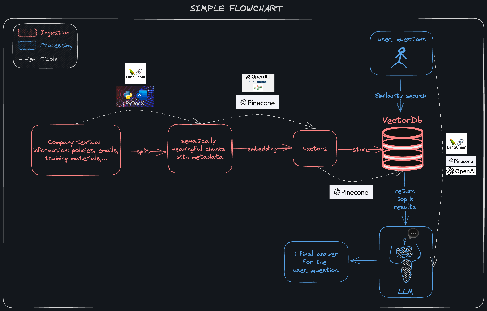

Builing an Internal AI Assistant
==============================

# Overview

The project aims to leverage the natural language processing capabilities of Large Language Models (LLM) by providing them with additional information about the specific domains we want to exploit.

In this case, the project is specifically focused on building a Company Internal AI Assistant that possesses the ability to answer questions about the company's policies and business knowledge *(but the framework is totally applicable for other situations)*.

    

The AI Assistant would be able to help employees easily research internal textual information using natural language. This would result in:

1. Better familiarization with the vast corpus of information within a large company for new and junior employees
2. Lowering the burden of continuously answering repetitive questions for senior employees, making the process of training their successors more efficient.
3. A valuable tool for every employee when it comes to sensitive situations that need to meticulously consider the guidance of company policies or even government laws.

# Technique

The technique used to build this AI Assistant can be simplify into the following flowchart. The flowchart contains of 2 main phases:

1. Ingestion: Converting company textual information into embeded vector & storing in a vector database for querying later.
2. Processing: Processing the users' question, using similarity search to retrieve relevant information from the vector database & then feed it to LLMs to get the final answer.

## Ingestion

> More information will be updated later

## Processing

> More information will be updated later

# Project Organization

    ├── README.md          <- The top-level README for developers using this project.
    ├── data
    │   ├── external       <- Data from third party sources.
    │   ├── interim        <- Intermediate data that has been transformed.
    │   ├── processed      <- The final, canonical data sets for modeling.
    │   └── raw            <- The original, immutable data dump.
    │
    ├── docs               <- Contains a .excalidraw file for visualizing processes, creating figures used for documenting the project.
    │
    ├── notebooks          <- Jupyter notebooks: mostly for testing purposes before writing src code.
    │
    ├── requirements.txt   <- The requirements file for reproducing the python environment. Generated with `pip freeze > requirements.txt`
    │
    └── src                <- Source code for use in this project.
        ├── __init__.py    <- Makes src a Python module
        │
        ├── data           <- Scripts to download or generate data
        │   ├── doc2text-w-pydocx.py:     Using pydocx & Pandas to convert .docx to .xlsx files with metadata.
        │   ├── ingestion.py:             Read the .xlsx files, convert to vector with metadata & store in Pinecone
        │   └── segmenting-vnese.py:      Using VnCoreNLP-word-segmentor to segment Vnese text. 
        │
        └── features       <- Scripts to turn raw data into features for modeling
            ├── app.py:                   Creating a web app using Streamlit
            ├── htmlTemplates.py:         The html_templates for Q&A interface in app.py
            └── models_testing.py:        Testing models on huggingface

# Quick start

> More information will be updated later  

--------

<small>Project based on the <a target="_blank" href="https://drivendata.github.io/cookiecutter-data-science/">cookiecutter data science project template</a>. #cookiecutterdatascience</small>

